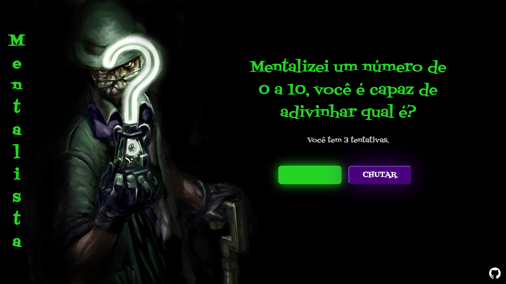

<h1 align="center">Mentalista</h1>

    
      
    
Encare o charada e tente adivinhar o número entre 0 a 10 que ele tem em mente.

    <a href="https://ig0r-ferreira.github.io/mentalista/">Clique aqui para jogar</a>

## Sobre
O [Mentalista](https://ig0r-ferreira.github.io/mentalista/) é um jogo de adivinhação de número entre 0 e 10, no qual o jogador terá 3 tentativas para acertar. 
Esse jogo foi desenvolvido durante o <strong>Imersão Dev 2022</strong> realizado pela Alura.

## Tecnologias Utilizadas

## Autor

-   [Igor Ferreira](https://github.com/ig0r-ferreira)

## Licença

Este projeto está sob a licença do [MIT](LICENSE).
